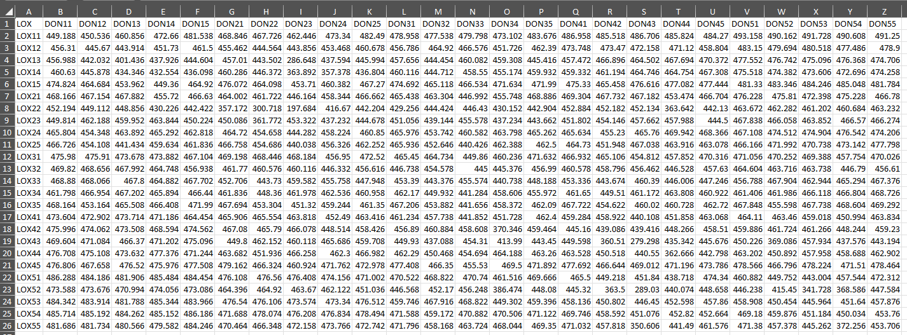
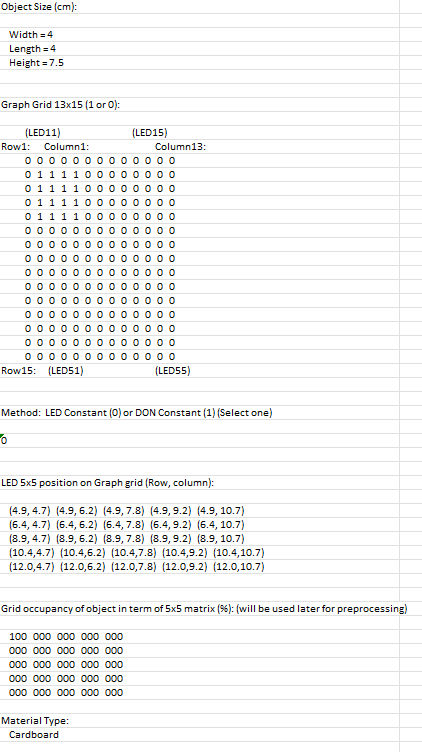
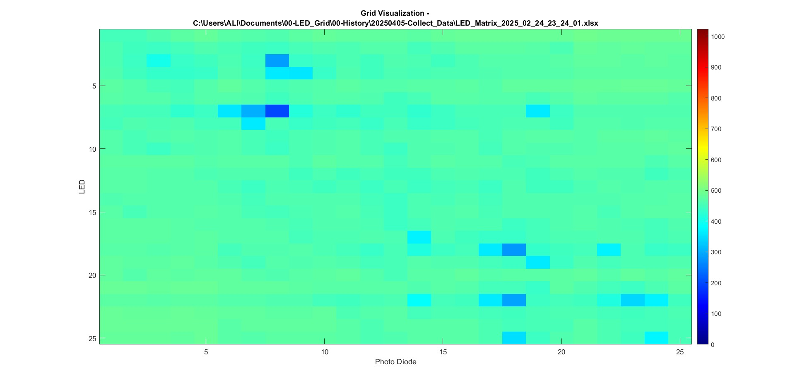
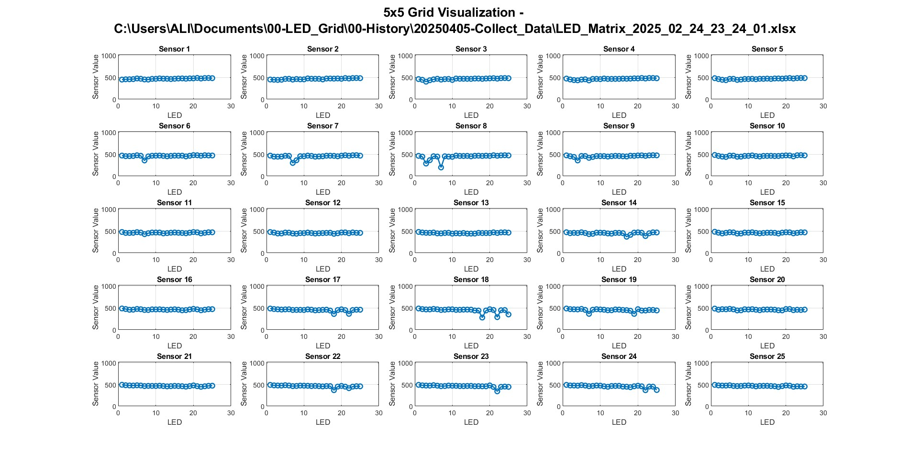
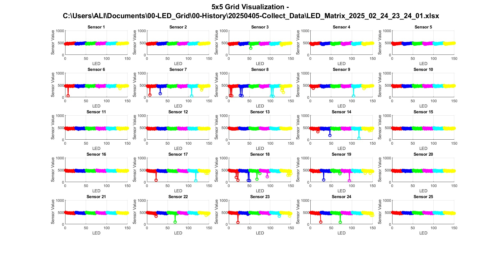
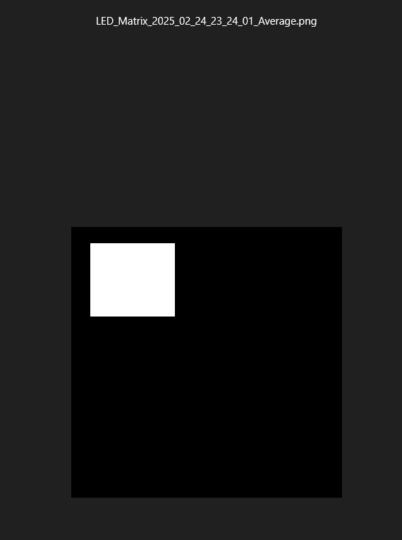
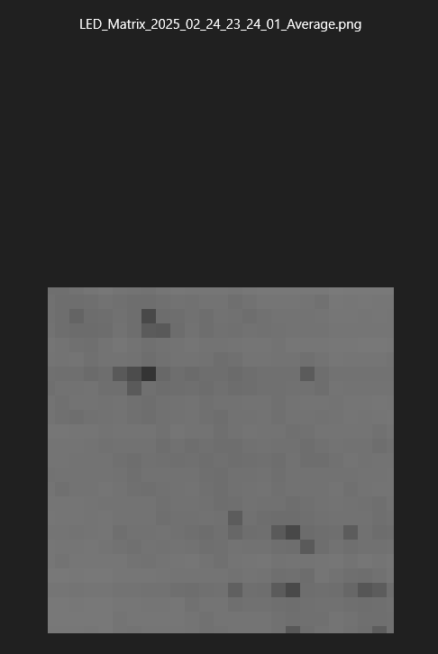

# 🔬 LED Matrix Data Collection & Preprocessing Pipeline (MATLAB)

This stage of the pipeline handles real-world data collection from an LED matrix and photodiode hardware setup, using MATLAB. It creates, averages, and visualizes raw sensing data, and then prepares image and mask files for machine learning.

---

## ⚙️ Pipeline Overview

📡 Data Collection (.m) └── 🧾 Physical Setup (.txt) └── 📊 Data Visualization (.m) └── 🖼️ Image + Mask Creation & Dataset Split (.m)

---

## 📁 MATLAB Files Breakdown

### 1️⃣ [`Collect_Multiple_Data.m`](./matlabPipeline/Collect_Multiple_Data.m)

#### **Purpose:**
- Collects N (user-defined) measurements from the hardware via serial communication.
- Stores data in an Excel file with time-based naming.
- Averages across all measurements to reduce noise.
- Writes hardware configuration details into the Excel file.

#### **Key Functions:**
- `Initialize_Device()` – Connects to the Arduino.
- `collect_data()` – Collects sensor data for a 5x5 LED/diode grid.
- `Average()` – Averages readings from multiple Excel sheets.
- `Arduino_Data_Collection_L()` / `D()` – Control which device remains fixed during data collection (LED or Diode).
- 

---

### 2️⃣ [`Physical_Setup.txt`](./matlabPipeline/Physical_Setup.txt)

#### **Purpose:**
Defines physical parameters and grid layout of the experiment.

#### **Includes:**
- Object size (e.g., 3x3x5 cm)
- 13x15 grid layout with binary object occupancy matrix
- LED/diode method used (fixed LED or diode)
- Exact (x, y) positions of 5x5 LEDs
- Material type and shape
- Metadata like delay time, sample count, etc.

✅ This setup file is read and verified in `Collect_Multiple_Data.m`.

---

### 3️⃣ [`Data_Collection_Visualization.m`](./matlabPipeline/Data_Collection_Visualization.m)

#### **Purpose:**
Visualizes collected data from the Excel file.

#### **Features:**
- User chooses heatmap or graph visualization.
- Can visualize individual or all sheets.
- Shows sensor values in 5x5 grid layout.
- Displays values scaled to 0–1024.
- Also prints physical setup info to console or GUI.

### **HeatMap**

### **Graph**

### **Overall Graph**

---

### 4️⃣ [`Data_Image_Mask.m`](./matlabPipeline/Data_Image_Mask.m)

#### **Purpose:**
Processes the Excel files to create image/mask datasets.

#### **Steps:**
1. **Reads binary matrix from `Physical_Setup` sheet**  
   → Generates **mask images** (binary object segmentation).

2. **Reads averaged sensor data**  
   → Converts to **grayscale images** for model input.

3. **Preprocessing:**  
   - Resizes and normalizes images.
   - Converts each `.xlsx` file into multiple `.png` images.

4. **Dataset Split:**  
   - Shuffles and splits all images/masks into:
     - `train/`
     - `val/`
     - `test/`

✅ Output ready for training with U-Net model or other segmentation frameworks.

---

## 🗂️ Output Structure

📁 99-ImagePreProcessing/ ├── Images/ └── Masks/ 📁 99-Splited_Data(for training)/ ├── train/ ├── val/ └── test/

---

## 🔧 Requirements

To run these files, make sure you have:
- MATLAB (R2020+ recommended)
- A working serial connection to the LED/photodiode hardware
- Excel installed (for reading/writing `.xlsx`)
- Properly updated file paths in the `.m` scripts

---

# LED Sensing

**LED Matrix Data for Image Segmentation using a U-Net Model for Object Detection**

This project utilizes data collected from an LED matrix-based sensing device and processes it through an image segmentation pipeline using a U-Net model to detect object positions.

---

## 📡 Data Collection

The input data is collected using MATLAB from the sensing device.

### Sample Input and Output

Below is an example of the Physical setup of the LED Matrix with object position considered as input and the corresponding output

The device processes this input and returns a **25x25** array. To reduce noise, we take the **average of 5 consecutive readings**:

---
After this I processed this 25x25 matrix into a 25x25 binary image using the MATLAB Image creation Pipeline.
Below is an example of a 25x25 binary image.

## 🛠️ Preprocessing and Model Training
## 📓 Jupyter Notebooks

Check out the notebooks in the folder [jupyterNotebooks](./jupyterNotebooks/).

### 🔄 Preprocessing
- Convert the 25x25 matrix into an image.
- Rescale the image to match the input size required by the model.

### Data Preprocessing

X = X.reshape(-1, 25, 25, 1)
Y = Y.reshape(-1, 25, 25, 1)

### 🏷️ Labeling
- Annotate each preprocessed image with ground truth data representing the object’s location.

### 🧠 Model Training
- Train a **U-Net model** using the labeled dataset.
- The model learns to predict the position of the object in new unseen input arrays.

---

## 📁 Project Structure (optional)
# 🔁 LED Matrix Object Detection Pipeline

This repository follows a 3-step pipeline using Jupyter notebooks to perform object detection with LED matrix data using a U-Net model.

---

## 🧩 Pipeline Overview

1. **Data Preprocessing**
2. **Model Training**
3. **Prediction & Inference**

---

## 📁 Notebook Breakdown

### 1️⃣ [01-Data_Preprocessing.ipynb](./jupyterNotebooks/01-Data_Preprocessing.ipynb)

#### **Purpose**  
Prepares raw LED matrix data for training. This includes:
- Reading and importing raw `.mat` files or numerical arrays.
- Averaging multiple readings to smooth the data.
- Converting matrix data to grayscale images.
- Saving preprocessed data in image format for labeling and training.

---

### 2️⃣ [02-LED_Matrix_Train_Model.ipynb](./jupyterNotebooks/02-LED_Matrix_Train_Model.ipynb)

#### **Purpose**  
Trains a U-Net model on the preprocessed LED matrix data.

- Loads labeled training data.
- Defines the U-Net architecture.
- Trains the model using segmentation masks.
- Saves the trained model weights for future inference.

---

### 3️⃣ [03-LED_Matrix_Prediction.ipynb](./jupyterNotebooks/03-LED_Matrix_Prediction.ipynb)

#### **Purpose**  
Uses the trained model to predict object locations from new LED matrix input.

- Loads new/unseen LED matrix data.
- Preprocesses the input for prediction.
- Uses the trained U-Net model to make segmentation predictions.
- Visualizes predicted vs. actual locations.
