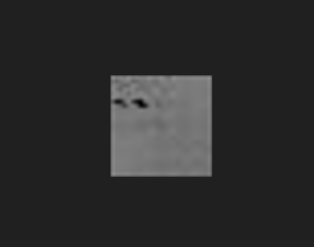

# LED Sensing

**LED Matrix Data for Image Segmentation using a U-Net Model for Object Detection**

This project utilizes data collected from an LED matrix-based sensing device and processes it through an image segmentation pipeline using a U-Net model to detect object positions.

---

## 📡 Data Collection

The input data is collected using MATLAB from the sensing device.

### Sample Input and Output

Below is an example of the Physical setup of the LED Matrix with object position considered as input and the corresponding output

The device processes this input and returns a **25x25** array. To reduce noise, we take the **average of 5 consecutive readings**:

---
After this I processed this 25x25 matrix into a 25x25 binary image using the MATLAB Image creation Pipeline.
Below is an example of a 25x25 binary image.

## 🛠️ Preprocessing and Model Training
## 📓 Jupyter Notebooks

Check out the notebooks in the folder [jupyterNotebooks](./jupyterNotebooks/).

### 🔄 Preprocessing
- Convert the 25x25 matrix into an image.
- Rescale the image to match the input size required by the model.

### 🏷️ Labeling
- Annotate each preprocessed image with ground truth data representing the object’s location.

### 🧠 Model Training
- Train a **U-Net model** using the labeled dataset.
- The model learns to predict the position of the object in new unseen input arrays.

---

## 📁 Project Structure (optional)
# 🔁 LED Matrix Object Detection Pipeline

This repository follows a 3-step pipeline using Jupyter notebooks to perform object detection with LED matrix data using a U-Net model.

---

## 🧩 Pipeline Overview

1. **Data Preprocessing**
2. **Model Training**
3. **Prediction & Inference**

---

## 📁 Notebook Breakdown

### 1️⃣ [01-Data_Preprocessing.ipynb](./jupyterNotebooks/01-Data_Preprocessing.ipynb)

#### **Purpose**  
Prepares raw LED matrix data for training. This includes:
- Reading and importing raw `.mat` files or numerical arrays.
- Averaging multiple readings to smooth the data.
- Converting matrix data to grayscale images.
- Saving preprocessed data in image format for labeling and training.

---

### 2️⃣ [02-LED_Matrix_Train_Model.ipynb](./jupyterNotebooks/02-LED_Matrix_Train_Model.ipynb)

#### **Purpose**  
Trains a U-Net model on the preprocessed LED matrix data.

- Loads labeled training data.
- Defines the U-Net architecture.
- Trains the model using segmentation masks.
- Saves the trained model weights for future inference.

---

### 3️⃣ [03-LED_Matrix_Prediction.ipynb](./jupyterNotebooks/03-LED_Matrix_Prediction.ipynb)

#### **Purpose**  
Uses the trained model to predict object locations from new LED matrix input.

- Loads new/unseen LED matrix data.
- Preprocesses the input for prediction.
- Uses the trained U-Net model to make segmentation predictions.
- Visualizes predicted vs. actual locations.
